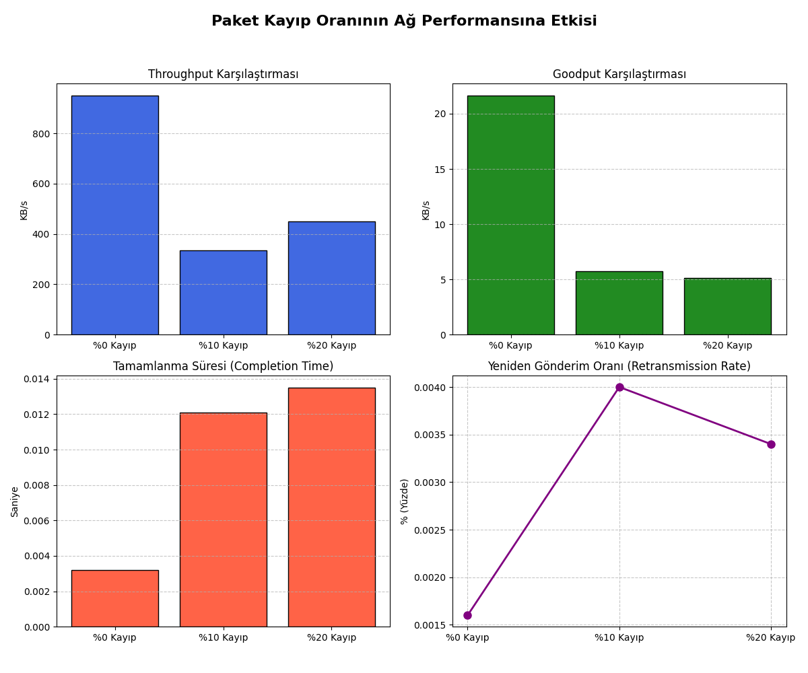
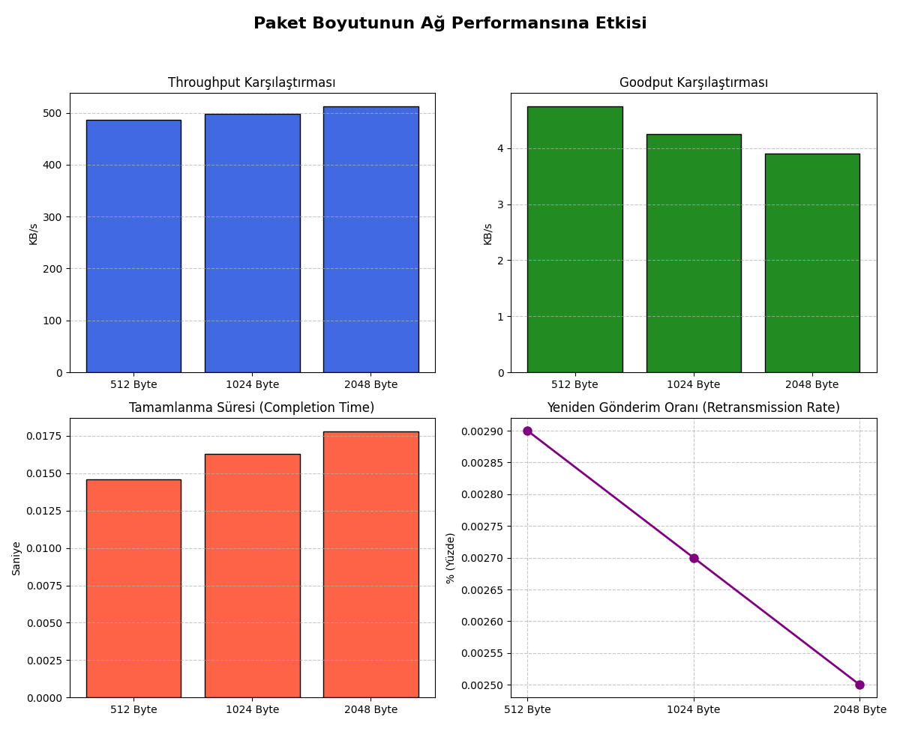
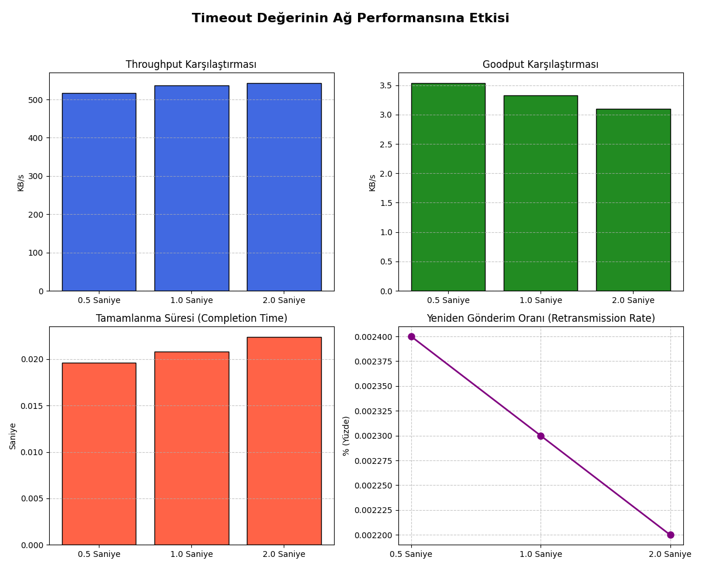
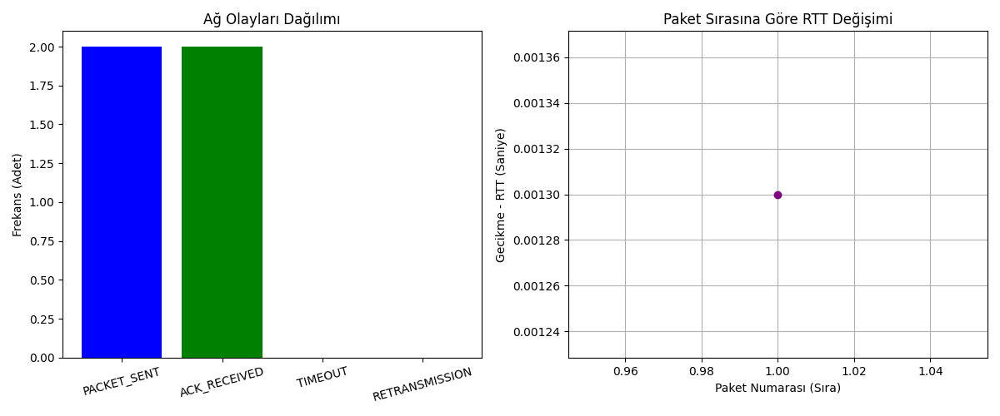

# NetProbe: UDP Tabanlı Güvenilir Dosya Aktarımı ve Ağ Performans Analizi Platformu

Bu proje, **Bursa Teknik Üniversitesi Bilgisayar Ağları dersi dönem projesi** kapsamında geliştirilmiştir. Projenin temel amacı, standart UDP protokolü üzerinde uygulama katmanında güvenilir bir dosya aktarım mekanizması tasarlamak, ağ trafiğini izlemek ve performans analizleri yapmaktır.

---

## 📌 Protokol Açıklaması

NetProbe, UDP'nin doğasında bulunmayan güvenilirlik mekanizmalarını kendi özel iletişim protokolü ile sağlar:

* **Veri Bölümleme ve Paketleme:** Aktarılacak dosya belirli boyutlarda (örn. 1024 byte) parçalara bölünür. Her paket `DATA|Sequence_Number|Payload` formatında iletilir.
* **Sequence Number (Sıra Numarası):** Gönderilen her pakete benzersiz bir sıra numarası atanır. Bu sayede alıcı tarafında (Server) aynı paketin tekrar gelip gelmediği (Duplicate) tespit edilir.
* **ACK Mekanizması:** Sunucu, başarıyla aldığı her paket için istemciye bir `ACK|Sequence_Number` mesajı gönderir. İstemci, bu mesajı almadan bir sonraki pakete geçmez (Stop-and-Wait yaklaşımı).
* **Timeout ve Yeniden Gönderim (Retransmission):** İstemci, paketi gönderdikten sonra belirli bir süre (Timeout) içinde ACK alamazsa paketi tekrar gönderir. Bir paket için maksimum 5 deneme yapılır.
* **Bütünlük Kontrolü:** Dosya aktarımı tamamlandıktan sonra, gönderilen dosya ile alınan dosyanın SHA-256 hash değerleri karşılaştırılarak veri bütünlüğü doğrulanır.

---

## 🚀 Çalıştırma Adımları

Proje yerel ağda (`localhost`) çalışmak üzere yapılandırılmıştır. Sistemi ayağa kaldırmak ve analiz yapmak için aşağıdaki adımları sırasıyla uygulayınız:

### 1. Sunucuyu (Server) Başlatma
Bir terminal açarak projenin bulunduğu dizine gidin ve sunucuyu çalıştırın:

```
python server.py

```
*(Not: Windows ortamında `python` yerine `py` komutu kullanılması gerekebilir.)*

### 2. İstemciyi (Client) Başlatma ve Aktarım

Farklı bir terminal ekranı açın ve istemciyi çalıştırarak dosya aktarımını başlatın:

```
python client.py

```

Aktarım sırasında yaşanan tüm olaylar (PACKET_SENT, ACK_RECEIVED, TIMEOUT vb.) `logs/transfer.log` dosyasına kaydedilecektir.

### 3. Log Analizi (Tekil Aktarım İçin)

Aktarım bittikten sonra gecikme (RTT), throughput, goodput ve retransmission oranını hesaplamak için:

```
python analyzer.py

```

### 4. Karşılaştırmalı Deney Grafiklerini Üretme

Farklı senaryolarda elde edilen verilerin grafiğe dökülmesi için:

```
python plot_experiments.py

```

---

## 📊 Deney Sonuçları ve Grafikler

Proje kapsamında farklı ağ koşulları altında çeşitli performans deneyleri gerçekleştirilmiştir. Elde edilen sonuçlar `results/` klasöründe grafikler halinde saklanmıştır.

### 1. Yapay Paket Kaybı Senaryosu

Farklı paket kaybı oranlarının sistem performansına etkisi incelenmiştir.



Bu deneyde paket kaybı arttıkça yeniden gönderim (retransmission) sayısının yükseldiği ve sistemin etkin veri aktarım oranının (goodput) düştüğü gözlemlenmiştir.

---

### 2. Paket Boyutu Senaryosu

512 Byte, 1024 Byte ve 2048 Byte paket boyutları test edilmiştir.



Küçük paket boyutlarında başlık (header) yükünün arttığı, büyük paket boyutlarında ise daha yüksek throughput değerlerine ulaşıldığı görülmüştür.

---

### 3. Timeout Süresi Senaryosu

0.5 saniye, 1 saniye ve 2 saniye timeout değerleri karşılaştırılmıştır.



Çok düşük timeout değerlerinde gereksiz yeniden gönderimlerin arttığı, çok yüksek timeout değerlerinde ise hata tespit süresinin uzadığı gözlemlenmiştir.

---

### 4. Genel Performans Özeti

Tüm deney sonuçlarının genel karşılaştırması aşağıdaki grafikte verilmiştir.



Bu grafikler sistemin farklı ağ koşulları altında davranışını göstermekte ve geliştirilen güvenilir UDP protokolünün performansını değerlendirmeye yardımcı olmaktadır.


---

## ⚠️ Karşılaşılan Sorunlar ve Çözümler

* **Mükerrer Paket (Duplicate) Sorunu:** Testler sırasında timeout nedeniyle tekrar gönderilen paketlerin, sunucu tarafında dosyaya iki kez yazılması sonucu dosya bütünlüğünün bozulduğu fark edildi. Bu sorun, sunucu tarafına gelen paketlerin `Sequence Number` değerlerinin bir küme (`set`) içerisinde tutulması ve mükerrer paketlerin sadece ACK döndürülüp dosyaya yazılmaması ile çözüldü.
* **Yanlış RTT Hesaplanması:** Zaman aşımına uğrayan ve tekrar gönderilen paketlerin ilk gönderim zamanı baz alındığında, RTT değerlerinin gerçek dışı şekilde yüksek çıktığı görüldü. `client.py` içerisindeki süre başlatma fonksiyonu (`start_time`), her yeniden gönderim döngüsünün en başına alınarak bu mantıksal hata giderildi.
* **Windows Komut Satırı Sorunu:** Başlangıçta betikleri çalıştırırken `python3` komutu tanımlanmadığı için hatalar alındı. Çözüm olarak geliştirme ve test ortamında `python` veya `py` çağrılarına geçiş yapıldı.

---

## 👨‍💻 Geliştiriciler

- Aynur Adıbelli
- Zeynep Kaya

Bursa Teknik Üniversitesi 
Bilgisayar Ağları Dersi Dönem Projesi (2025-2026)
